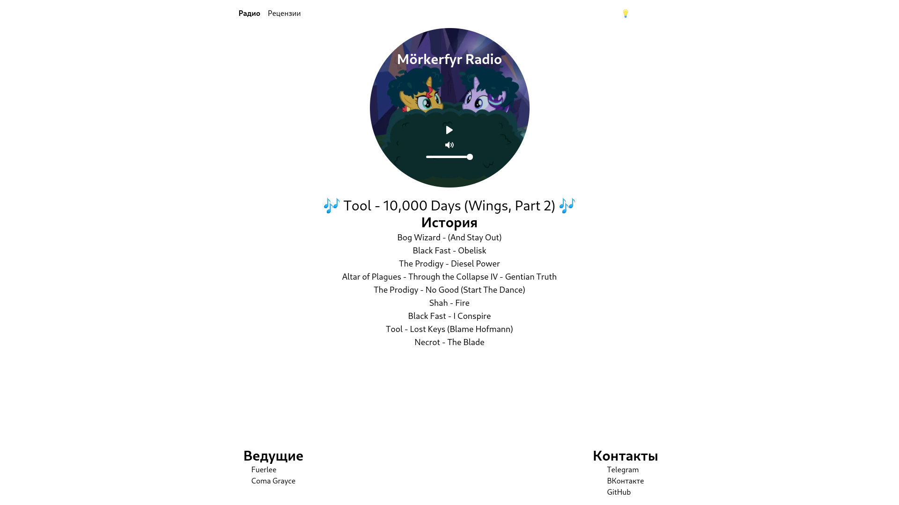
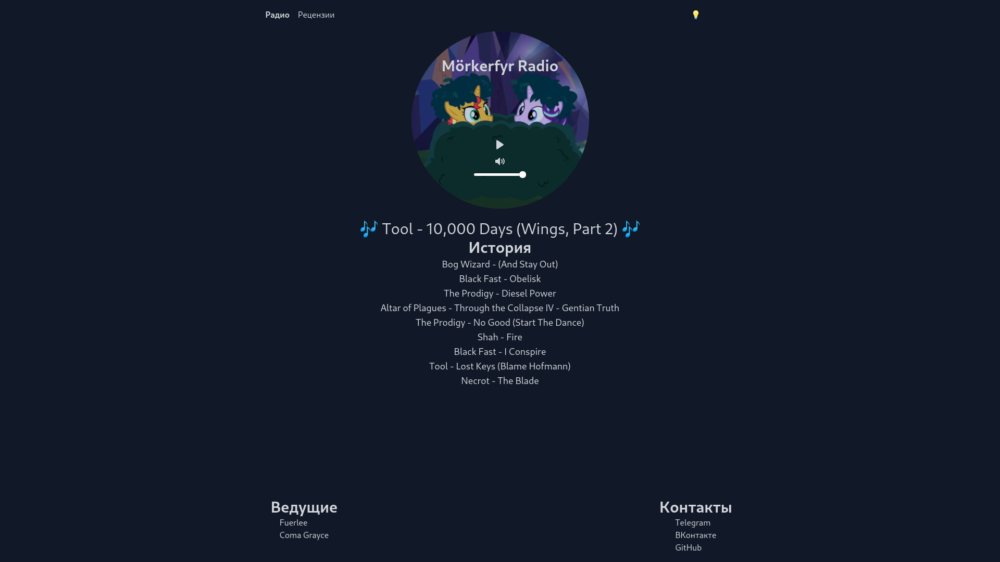

# Mörkerfyr Radio

Simple frontend for **non-free** [Rocket Streaming Audio Server](https://rocketbroadcaster.com/streaming-audio-server/)
using [Svelte](https://svelte.dev/), [Sapper](https://sapper.svelte.dev/),
and [Tailwind CSS](https://tailwindcss.com/).


| Light Theme                              | Dark Theme                              |
|------------------------------------------|-----------------------------------------|
|  |  |

## Features

- Plays radio stream from RSAS (and any Icecast-compatible server)
- Shows playing track and history of played tracks (using RSAS-exclusive API endpoints)
- Dark theme switcher
- Markdown-powered blog
- It's ugly! (plz halp)

### TODO

- RSS feed for the blog
- Clickable tags for blog posts
- Play radio when lurking other pages

## Development

### Requirements

- Node.js
- Yarn
- [Rocket Streaming Audio Server](https://rocketbroadcaster.com/streaming-audio-server/)
- Some Icecast-compatible client, like [butt](http://danielnoethen.de/butt/)

### Steps

1. Launch RSAS with the following config:
```
$ cat config.xml
<icecast>
    <listen-socket>
        <port>8000</port>
        <bind-address>127.0.0.1</bind-address>
    </listen-socket>

    <mount>
        <mount-name>/stream</mount-name>
        <username>source</username>
        <password>hackme</password>
    </mount>
</icecast>

$ rsas -c config.xml
```
2. Start stream with `butt` or any other Icecast-compatible client
3. Clone repository and install dependencies:
```
git clone https://github.com/innereq/morkerfyr && cd morkerfyr
yarn
```
4. Change `radio_host` in the `morkerfyr.config.js` to `127.0.0.1:8000`
5. Start development server with `yarn dev`

## Building

Use `yarn export` to build a bunch of static HTML.